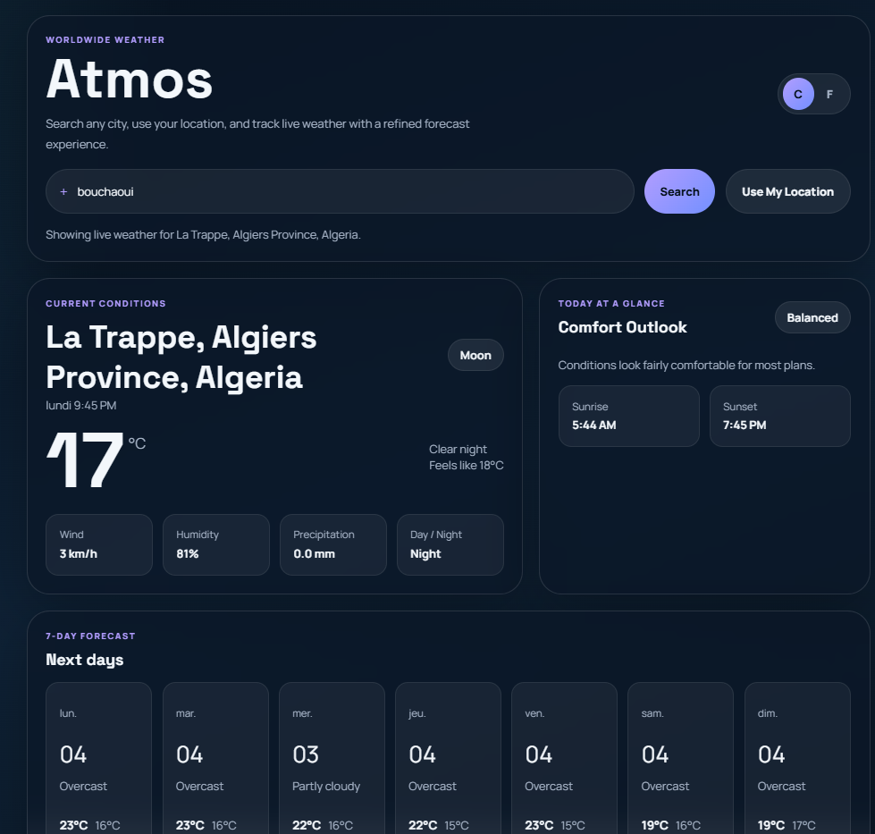

# Atmos - Worldwide Weather App

A modern, responsive weather application that provides real-time weather information and forecasts for cities worldwide. Built with HTML, CSS, and JavaScript, featuring a sleek glassmorphism design and intuitive user interface.

## 🌟 Features

- **City Search**: Search for weather in any city, country, or region
- **Location-Based Weather**: Use your current location for instant weather updates
- **Current Conditions**: Live temperature, humidity, wind speed, precipitation, and more
- **7-Day Forecast**: Detailed weather predictions for the upcoming week
- **Unit Toggle**: Switch between Celsius and Fahrenheit
- **Comfort Outlook**: Personalized comfort assessment based on current conditions
- **Responsive Design**: Optimized for desktop and mobile devices
- **Dark Theme**: Modern dark UI with glassmorphism effects

## 📸 Screenshots



## 🚀 Getting Started

### Prerequisites

- A modern web browser (Chrome, Firefox, Safari, Edge)
- Internet connection for weather data

### Installation

1. Clone the repository:
   ```bash
   git clone https://github.com/yourusername/atmos-weather-app.git
   ```

2. Navigate to the project directory:
   ```bash
   cd atmos-weather-app
   ```

3. Open `index.html` in your web browser or serve it with a local server.

### Usage

1. **Search by City**: Enter a city name in the search bar and click "Search"
2. **Use Location**: Click "Use My Location" to get weather for your current position
3. **Toggle Units**: Switch between Celsius (°C) and Fahrenheit (°F) using the unit buttons
4. **View Forecast**: Scroll down to see the 7-day weather forecast

## 🛠️ Technologies Used

- **HTML5**: Semantic markup and structure
- **CSS3**: Custom properties, flexbox, grid, and glassmorphism effects
- **JavaScript (ES6+)**: DOM manipulation, async/await, and API integration
- **Open-Meteo API**: Free weather and geocoding services
- **Google Fonts**: Space Grotesk and Manrope font families

## 📡 APIs

This app uses the following free APIs:
- [Open-Meteo Weather API](https://open-meteo.com/) - Weather data and forecasts
- [Open-Meteo Geocoding API](https://open-meteo.com/en/docs/geocoding-api) - City search and coordinates

No API keys required!

## 🎨 Design Features

- **Glassmorphism**: Semi-transparent cards with backdrop blur effects
- **Dynamic Theming**: Background colors change based on weather conditions
- **Smooth Animations**: Subtle transitions and hover effects
- **Accessibility**: Proper ARIA labels and keyboard navigation support

## 🤝 Contributing

Contributions are welcome! Please feel free to submit a Pull Request.

## 📄 License

This project is open source and available under the [MIT License](LICENSE).

## 🙏 Acknowledgments

- Weather data provided by [Open-Meteo](https://open-meteo.com/)
- Icons and symbols inspired by weather condition codes
- Font families from [Google Fonts](https://fonts.google.com/)</content>
<parameter name="filePath">c:\xampp\htdocs\weather\README.md